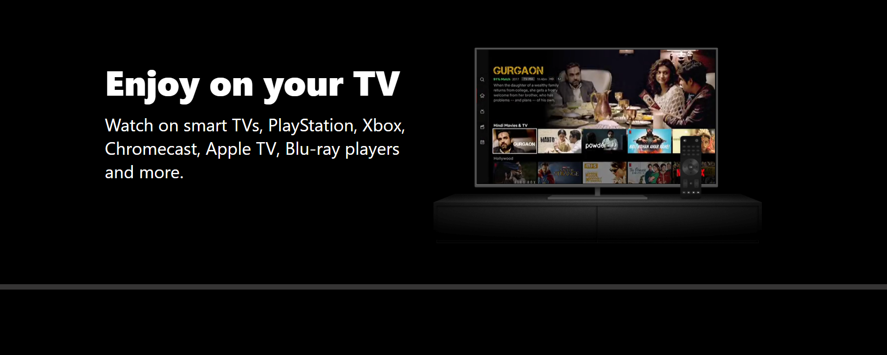
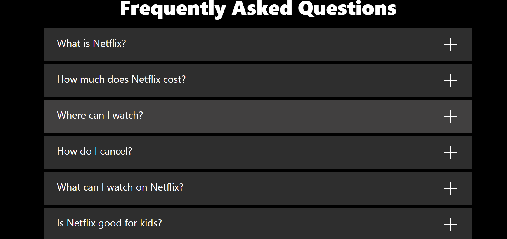
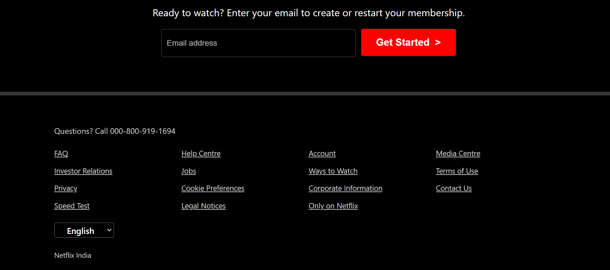

# Netflix Clone

A responsive Netflix clone created using only HTML and CSS. This project replicates the Netflix user interface, showcasing skills in layout design with Flexbox, CSS Grid, and positioning techniques.

## Features

- Fully responsive design
- Clean and simple UI resembling Netflix
- Built with HTML and CSS
- Uses Flexbox and CSS Grid for layout
- Positioning techniques for precise element placement

## Technologies Used

- **HTML5**
- **CSS3**

## Getting Started

To view the project, simply clone the repository and open the `index.html` file in your browser.

### Clone the Repository

```bash
git clone https://github.com/gitterrrr/Netflix-Clone-using-HTML-and-CSS.git
cd Netflix-Clone-using-HTML-and-CSS
```
## Screenshots





## License
This project is open source and available under the [MIT License](LICENSE).

